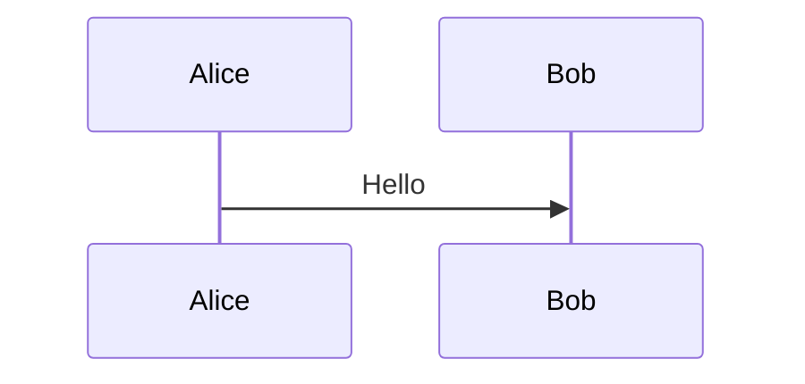

# Яндекс Трекер — Справка для MCP-сервера

Документ содержит только то, чем можно управлять через Yandex Tracker API. Основа — библиотека YaTrackerApi.

---

## 1. Подключение и авторизация

- **Base URL:** `https://api.tracker.yandex.net/v3` (v2 для фильтров)
- **Заголовки:** `Authorization: OAuth {token}`, `X-Org-ID: {org_id}`, `Content-Type: application/json`
- **Таймауты:** total=30s, connect=10s, read=10s
- **Пул соединений:** limit=100, limit_per_host=30
- **Health check:** `GET /myself` — проверка токена и доступности

---

## 2. Сущности и API-операции

### 2.1 Задача (Issue)

Центральная сущность. Принадлежит одной очереди.

**Атрибуты:**

| Атрибут | Тип | Описание |
|---------|-----|----------|
| key | string | Уникальный ключ: `QUEUE-123` |
| summary | string | Название (макс 255) |
| description | string | Описание (макс 512000) |
| queue | string/object | Очередь |
| status | object | Статус |
| type | string/object | Тип: `bug`, `task`, `story`, `epic` |
| priority | string/object | Приоритет: `blocker`, `critical`, `normal`, `minor`, `trivial` |
| assignee | string/object | Исполнитель |
| author | object | Автор (read-only, по токену) |
| followers | list | Наблюдатели |
| tags | list[string] | Теги |
| components | list | Компоненты |
| sprint | list | Спринты |
| project | object | Проект: `{"primary": shortId}` (shortId — число) |
| parent | string/object | Родительская задача |
| deadline | string | Дедлайн (YYYY-MM-DD) |
| start / end | string | Даты начала/окончания |
| storyPoints | float | Story Points |
| originalEstimation | string | Первоначальная оценка (ISO 8601: PT2H) |
| estimation | string | Текущая оценка |
| spent | string | Затрачено |
| resolution | object | Резолюция |
| unique | string | Уникальный внешний ID (защита от дублей) |

**API-операции:**

| Метод | Эндпоинт | Описание |
|-------|----------|----------|
| POST | `/issues` | Создать задачу |
| GET | `/issues/{key}` | Получить (expand: `transitions`, `attachments`) |
| PATCH | `/issues/{key}` | Обновить (tags/followers поддерживают `{add:[], remove:[]}`) |
| POST | `/issues/{key}/_move` | Перенести в другую очередь |
| POST | `/issues/_search` | Поиск (filter dict ИЛИ query string) |
| POST | `/issues/_count` | Подсчёт |

**Кастомные поля (localfields):** передаются через `localfields={"myField": "value"}` — попадают в корень payload.

**Ограничения поиска:** нельзя использовать более 2 из (queue, keys, filter, query) одновременно.

**Задачи НЕ удаляются через API** — только закрытие через переход.

### 2.2 Комментарий (Comment)

К задачам и сущностям.

| Атрибут | Тип | Описание |
|---------|-----|----------|
| text | string | Текст (YFM-разметка) |
| summonees | list | Призванные пользователи |
| maillistSummonees | list | Призванные рассылки |
| attachment_ids | list | ID вложений |
| markup_type | string | `"md"` для YFM |

**API задач:**

| Метод | Эндпоинт | Описание |
|-------|----------|----------|
| GET | `/issues/{key}/comments` | Список (expand: `attachments`, `html`, `all`) |
| POST | `/issues/{key}/comments` | Создать |
| PATCH | `/issues/{key}/comments/{id}` | Обновить |
| DELETE | `/issues/{key}/comments/{id}` | Удалить |

**API сущностей:**

| Метод | Эндпоинт | Описание |
|-------|----------|----------|
| GET | `/entities/{type}/{id}/comments` | Список |
| POST | `/entities/{type}/{id}/comments` | Создать |
| PATCH | `/entities/{type}/{id}/comments/{cid}` | Обновить |
| DELETE | `/entities/{type}/{id}/comments/{cid}` | Удалить |

### 2.3 Вложение (Attachment)

**API задач:**

| Метод | Эндпоинт | Описание |
|-------|----------|----------|
| GET | `/issues/{key}/attachments` | Список |
| POST | `/issues/{key}/attachments/` | Прикрепить (multipart) |
| GET | `/issues/{key}/attachments/{id}/{filename}` | Скачать (binary) |
| GET | `/issues/{key}/thumbnails/{id}` | Миниатюра (только изображения) |
| POST | `/attachments/` | Загрузить временный файл |
| DELETE | `/issues/{key}/attachments/{id}` | Удалить |

**Для сущностей — двухшаговый процесс:**
1. `POST /attachments/` → получить `temp_file_id`
2. `POST /entities/{type}/{id}/attachments` с `file_id`

### 2.4 Чеклист (Checklist)

| Атрибут | Тип | Описание |
|---------|-----|----------|
| text | string | Текст пункта |
| checked | bool | Выполнен |
| assignee | string | Исполнитель |
| deadline | object | `{"date": "...", "deadlineType": "date"}` |

**API задач:**

| Метод | Эндпоинт | Описание |
|-------|----------|----------|
| GET | `/issues/{key}/checklistItems` | Список |
| POST | `/issues/{key}/checklistItems` | Создать пункт |
| PATCH | `/issues/{key}/checklistItems/{id}` | Обновить пункт |
| DELETE | `/issues/{key}/checklistItems/{id}` | Удалить пункт |
| DELETE | `/issues/{key}/checklistItems` | Удалить весь чеклист |

**Для сущностей:** `POST /entities/{type}/{id}/checklistItems`. Create НЕ возвращает ID пунктов — нужен отдельный get с `fields=checklistItems`. Удаление чеклиста цели (goal) не работает — удаляйте по одному.

### 2.5 Связь между задачами (Link)

| Тип связи | relationship |
|-----------|-------------|
| Связана | `relates` |
| Зависит от | `depends on` |
| Блокирует | `is dependent by` |
| Подзадача | `is subtask for` |
| Родитель | `is parent task for` |
| Дубликат | `duplicates` / `is duplicated by` |
| Эпик | `is epic of` / `has epic` |
| Клон | `clone` / `original` |

| Метод | Эндпоинт | Описание |
|-------|----------|----------|
| GET | `/issues/{key}/links` | Список |
| POST | `/issues/{key}/links` | Создать |
| DELETE | `/issues/{key}/links/{id}` | Удалить |

### 2.6 Переход (Transition)

Смена статуса задачи в рамках рабочего процесса.

| Метод | Эндпоинт | Описание |
|-------|----------|----------|
| GET | `/issues/{key}/transitions` | Доступные переходы |
| POST | `/issues/{key}/transitions/{id}/_execute` | Выполнить переход |

Execute принимает: `comment`, поля задачи (assignee, resolution...), `localfields`.

### 2.7 Массовые операции (Bulk)

| Метод | Эндпоинт | Описание |
|-------|----------|----------|
| POST | `/bulkchange/_move` | Массовый перенос |
| POST | `/bulkchange/_update` | Массовое обновление (issues: list ИЛИ YQL-строка) |
| POST | `/bulkchange/_transition` | Массовая смена статуса |
| GET | `/bulkchange/{id}` | Статус операции |
| GET | `/bulkchange/{id}/issues` | Задачи с ошибками |

### 2.8 Очередь (Queue)

| Атрибут | Тип | Описание |
|---------|-----|----------|
| key | string | Ключ (латиница: `DEV`) |
| name | string | Название |
| lead | string/object | Владелец |
| defaultType | string | Тип задач по умолчанию |
| defaultPriority | string | Приоритет по умолчанию |
| issueTypesConfig | list | Типы + workflow ID |

| Метод | Эндпоинт | Описание |
|-------|----------|----------|
| GET | `/queues/` | Список (expand: `projects`, `components`, `versions`, `all`) |
| GET | `/queues/{key}` | Получить |
| POST | `/queues/` | Создать (нужен issueTypesConfig с workflow ID, напр. `"W4"`) |
| DELETE | `/queues/{key}` | Удалить |
| POST | `/queues/{key}/_restore` | Восстановить |

**Подмодули:**

| Метод | Эндпоинт | Описание |
|-------|----------|----------|
| GET | `/queues/{key}/versions` | Версии |
| POST | `/versions/` | Создать версию |
| GET | `/queues/{key}/fields` | Поля очереди |
| GET | `/queues/{key}/tags` | Теги |
| POST | `/queues/{key}/tags/_remove` | Удалить тег (body: `{"tag": "..."}`, 422 если используется) |
| PATCH | `/queues/{key}/permissions` | Изменить права (users/groups/roles с add/remove) |
| GET | `/queues/{key}/permissions/users/{uid}` | Права пользователя |
| GET | `/queues/{key}/permissions/groups/{gid}` | Права группы |

### 2.9 Сущности: Проект / Портфель / Цель

Единый API `/entities/{type}` где type: `project`, `portfolio`, `goal`.

**Общие атрибуты:**

| Атрибут | Тип | Описание |
|---------|-----|----------|
| id / shortId | string / int | Идентификаторы |
| summary | string | Название |
| description | string | Описание |
| lead | string | Ответственный |
| teamAccess | bool | Доступ только для участников |
| teamUsers | list[string] | Участники |
| clients | list[string] | Заказчики |
| followers | list[string] | Наблюдатели |
| start / end | string | Даты |
| tags | list[string] | Теги |
| entityStatus | string | Статус |
| parentEntity | object | Родитель: `{"primary": "id"}` |

**Статусы проектов/портфелей:** `draft`, `draft2`, `in_progress`, `according_to_plan`, `postponed`, `at_risk`, `blocked`, `launched`, `cancelled`

**Статусы целей:** `draft`, `according_to_plan`, `at_risk`, `blocked`, `achieved`, `partially_achieved`, `not_achieved`, `exceeded`, `cancelled`

| Метод | Эндпоинт | Описание |
|-------|----------|----------|
| POST | `/entities/{type}` | Создать |
| GET | `/entities/{type}/{id}` | Получить (fields=, expand=attachments) |
| PATCH | `/entities/{type}/{id}` | Обновить |
| DELETE | `/entities/{type}/{id}` | Удалить (withBoard=true для удаления с доской) |
| POST | `/entities/{type}/_search` | Поиск (input, filter, orderBy, rootOnly) |
| GET | `/entities/{type}/{id}/events/_relative` | История изменений |
| PATCH | `/entities/goal/{id}?fields=keyResultItems` | Ключевые результаты (только goal) |
| PATCH | `/entities/{type}/{id}?fields=metricItems` | Метрики |
| POST | `/entities/{type}/_bulkUpdate` | Массовое обновление |

**Важно:** без `fields=` API не возвращает summary, description, lead и др. С `fields=` данные в `entity.fields.summary`.

**Поиск возвращает:** `{"hits": N, "pages": N, "values": [...]}`

**Ключевые результаты (key_result_items):** list (заменить все), `{"add": {...}}`, `{"remove": {...}}`, None (удалить все). Объект KR: `{type: "value"|"binary", text, assignee?, deadline?, progress?: {start, end, current}, achieved?}`.

**Связи сущностей:**

| Метод | Эндпоинт | Описание |
|-------|----------|----------|
| GET | `/entities/{type}/{id}/links` | Получить |
| POST | `/entities/{type}/{id}/links` | Создать: `{relationship, entity}` |
| DELETE | `/entities/{type}/{id}/links/{lid}` | Удалить |

**Настройки доступа:**

| Метод | Эндпоинт | Описание |
|-------|----------|----------|
| GET | `/entities/{type}/{id}/settings` | Получить |

### 2.10 Доска (Board)

| Атрибут | Тип | Описание |
|---------|-----|----------|
| name | string | Название |
| owner | string | Владелец |
| boardPermissionsTemplate | string | `private` / `public` |
| backlogAvailable | bool | Бэклог |
| sprintsAvailable | bool | Спринты |

| Метод | Эндпоинт | Описание |
|-------|----------|----------|
| GET | `/boards` | Список |
| GET | `/boards/_paginate` | С курсорной пагинацией (perPage, id) |
| GET | `/boards/{id}` | Получить |
| POST | `/liveBoards/` | Создать (НЕ `/boards/`) |
| PATCH | `/boards/{id}` | Обновить |
| DELETE | `/boards/{id}` | Удалить |

**Колонки:**

| Метод | Эндпоинт | Описание |
|-------|----------|----------|
| GET | `/boards/{id}/columns` | Список |
| GET | `/boards/{id}/columns/{cid}` | Получить |
| POST | `/boards/{id}/columns/` | Создать |
| PATCH | `/boards/{id}/columns/{cid}` | Обновить |
| DELETE | `/boards/{id}/columns/{cid}` | Удалить |

Колонки требуют `If-Match: "{version}"`. Если board_version не передан — автозапрос.

**Спринты:**

| Метод | Эндпоинт | Описание |
|-------|----------|----------|
| GET | `/boards/{id}/sprints` | Список |
| GET | `/sprints/{id}` | Получить |
| POST | `/sprints` | Создать: `{name, board: {id}, startDate, endDate}` |

### 2.11 Автоматизации

#### Макросы

| Метод | Эндпоинт | Описание |
|-------|----------|----------|
| GET | `/queues/{q}/macros` | Список |
| GET | `/queues/{q}/macros/{id}` | Получить |
| POST | `/queues/{q}/macros` | Создать (name, body, issue_update) |
| PATCH | `/queues/{q}/macros/{id}` | Обновить |
| DELETE | `/queues/{q}/macros/{id}` | Удалить |

#### Автодействия

| Метод | Эндпоинт | Описание |
|-------|----------|----------|
| GET | `/queues/{q}/autoactions` | Список |
| GET | `/queues/{q}/autoactions/{id}` | Получить |
| POST | `/queues/{q}/autoactions` | Создать |
| PATCH | `/queues/{q}/autoactions/{id}` | Обновить |
| DELETE | `/queues/{q}/autoactions/{id}` | Удалить |
| GET | `/queues/{q}/autoactions/{id}/logs` | Логи |

Параметры: `actions`, `filter`/`query`, `active`, `interval_millis` (по умолч. 3600000), `calendar`.

#### Триггеры

| Метод | Эндпоинт | Описание |
|-------|----------|----------|
| GET | `/queues/{q}/triggers` | Список |
| GET | `/queues/{q}/triggers/{id}` | Получить |
| POST | `/queues/{q}/triggers` | Создать (name, actions, conditions, active) |
| PATCH | `/queues/{q}/triggers/{id}?version=N` | Обновить (авто-запрос version) |
| DELETE | `/queues/{q}/triggers/{id}` | Удалить |
| GET | `/queues/{q}/triggers/{id}/webhooks/log` | Логи вебхуков (limit макс 100) |

**Типы условий:** `Event.create`, `Event.update`, `Event.comment.create`, фильтры по полям.
**Типы действий:** `Transition`, `CreateComment`, `Update` полей, HTTP-запрос.
**Переменные:** `{{currentUser}}`, `{{issue.key}}`, `{{issue.summary}}`, `{{issue.assignee}}`, `{{now}}`.

### 2.12 Фильтры (API v2)

| Метод | Эндпоинт (v2) | Описание |
|-------|---------------|----------|
| POST | `/filters/` | Создать |
| GET | `/filters/{id}` | Получить |
| PATCH | `/filters/{id}` | Обновить |
| DELETE | `/filters/{id}` | Удалить |

Параметры: `name`, `filter` (dict) ИЛИ `query` (строка) — взаимоисключающие, `fields`, `sorts` (`[{"field": "...", "isAscending": true}]`), `group_by`, `folder`.

### 2.13 Дашборды и виджеты

| Метод | Эндпоинт | Описание |
|-------|----------|----------|
| POST | `/dashboards/` | Создать (name, layout, owner) |
| POST | `/dashboards/{id}/widgets/cycleTime` | Виджет «Время цикла» |

**Layout:** `one-column`, `two-columns`, `three-columns`, `narrow-left-wide-right`

**Cycle Time параметры:** `query`/`filter`/`filter_id`, `from_statuses`/`to_statuses`, `bucket` (`{unit: days/weeks/months/sprints, count}`), `lines` (`{movingAverage, standardDeviation, percentile, cakePercentile}`), `start`/`end`, `mode`.

### 2.14 Учёт времени (Worklog)

| Метод | Эндпоинт | Описание |
|-------|----------|----------|
| POST | `/issues/{key}/worklog` | Добавить (start, duration, comment) |
| GET | `/issues/{key}/worklog` | Список (курсорная пагинация: perPage макс 500, id) |
| POST | `/worklog/_search` | Поиск (createdBy, createdAt.from/to) |
| PATCH | `/issues/{key}/worklog/{id}` | Обновить |
| DELETE | `/issues/{key}/worklog/{id}` | Удалить |

**Формат duration:** ISO 8601 — `PT1H30M`, `P5DT20M`, `P1W`
**Формат start:** `YYYY-MM-DDThh:mm:ss.sss+hhmm`

### 2.15 Компоненты

| Метод | Эндпоинт | Описание |
|-------|----------|----------|
| GET | `/components` | Список |
| POST | `/components` | Создать (name, queue, description, lead, assign_auto) |
| PATCH | `/components/{id}?version=N` | Обновить (авто-запрос version) |
| GET | `/components/{id}/permissions/users/{uid}` | Права пользователя |
| GET | `/components/{id}/permissions/groups/{gid}` | Права группы |

### 2.16 Поля задач

**Глобальные:**

| Метод | Эндпоинт | Описание |
|-------|----------|----------|
| GET | `/fields` | Список |
| GET | `/fields/{id}` | Получить |
| POST | `/fields` | Создать |
| PATCH | `/fields/{id}?version=N` | Обновить |
| POST | `/fields/categories` | Создать категорию |
| PATCH | `/fields/categories/{id}?version=N` | Обновить категорию |

**Локальные:**

| Метод | Эндпоинт | Описание |
|-------|----------|----------|
| GET | `/queues/{q}/localFields` | Список |
| GET | `/queues/{q}/localFields/{key}` | Получить |
| POST | `/queues/{q}/localFields` | Создать |
| PATCH | `/queues/{q}/localFields/{key}` | Обновить (без version) |

**Типы полей:**

| Тип | Полный Java-путь |
|-----|-----------------|
| String | `ru.yandex.startrek.core.fields.StringFieldType` |
| Text | `ru.yandex.startrek.core.fields.TextFieldType` |
| Integer | `ru.yandex.startrek.core.fields.IntegerFieldType` |
| Float | `ru.yandex.startrek.core.fields.FloatFieldType` |
| Date | `ru.yandex.startrek.core.fields.DateFieldType` |
| DateTime | `ru.yandex.startrek.core.fields.DateTimeFieldType` |
| User | `ru.yandex.startrek.core.fields.UserFieldType` |
| Uri | `ru.yandex.startrek.core.fields.UriFieldType` |

**name:** `{"en": "English", "ru": "Русское"}`. **container=True** — мультизначение (String, User, с optionsProvider). **optionsProvider:** `{"type": "FixedListOptionsProvider", "values": ["A", "B"]}`.

### 2.17 Типы задач, статусы, резолюции, приоритеты

| Метод | Эндпоинт | Описание |
|-------|----------|----------|
| GET | `/issuetypes` | Типы задач |
| POST | `/issuetypes/` | Создать тип |
| PATCH | `/issuetypes/{id}?version=N` | Обновить |
| GET | `/statuses` | Статусы |
| POST | `/statuses/` | Создать (key, name, type) |
| PATCH | `/statuses/{id}?version=N` | Обновить |
| GET | `/resolutions` | Резолюции |
| POST | `/resolutions/` | Создать |
| PATCH | `/resolutions/{id}?version=N` | Обновить |
| GET | `/priorities` | Приоритеты |
| POST | `/priorities/` | Создать |
| PATCH | `/priorities/{id}?version=N` | Обновить |

**Типы статусов при создании:** `new`, `inProgress`, `paused`, `done`, `cancelled`

### 2.18 Импорт

Импорт из внешних систем с сохранением исторических дат и авторов.

| Метод | Эндпоинт | Описание |
|-------|----------|----------|
| POST | `/issues/_import` | Задача (queue, summary, createdAt, createdBy + все поля) |
| POST | `/issues/{key}/comments/_import` | Комментарий |
| POST | `/issues/{key}/links/_import` | Связь |
| POST | `/issues/{key}/attachments/_import` | Файл (multipart, params в query) |
| POST | `/issues/{key}/comments/{cid}/attachments/_import` | Файл к комментарию |

**Важно:** createdAt — единый часовой пояс (рекомендуется +0000). createdAt комментариев/связей/файлов должен попадать в [createdAt, updatedAt] задачи. Для связей — в интервал обеих задач.

### 2.19 Внешние связи

| Метод | Эндпоинт | Описание |
|-------|----------|----------|
| GET | `/applications` | Список внешних приложений |
| GET | `/issues/{key}/remotelinks` | Внешние связи задачи |
| POST | `/issues/{key}/remotelinks` | Создать (relationship, key, origin, backlink?) |
| DELETE | `/issues/{key}/remotelinks/{id}` | Удалить |

### 2.20 Пользователи

| Метод | Эндпоинт | Описание |
|-------|----------|----------|
| GET | `/myself` | Текущий пользователь (expand=groups) |
| GET | `/users/{uid}` | Получить (expand=groups) |
| GET | `/users` | Список (лимит 10000, фильтр: email, group) |
| GET | `/users/_relative` | Без лимита, курсорная (`{users, hasNext}`) |

Если логин из цифр — префикс `login:` (напр. `login:12345`).

---

## 3. Особенности API

### 3.1 Оптимистичная блокировка (version)

| Модуль | Передача |
|--------|---------|
| fields, categories, issue_types, statuses, resolutions, priorities | Query `?version=N` |
| triggers, components | Query `?version=N` (авто-запрос если не передан) |
| Колонки доски | Заголовок `If-Match: "{version}"` (авто-запрос) |

Без version — **428**. При конфликте — **409**.

### 3.2 Неудаляемые через API

- Задачи (только закрытие)
- Глобальные/локальные поля (только `hidden=True`)
- Категории полей

**Удаляемые:** комментарии, вложения, чеклисты, связи, сущности, фильтры, доски, компоненты.

### 3.3 snake_case → camelCase

Библиотека автоконвертирует: `per_page` → `perPage`, `start_date` → `startDate`.

### 3.4 Пагинация

| Тип | Модули |
|-----|--------|
| Страничная (page, perPage) | entities.search, issues.search, users.list |
| Курсорная (id последнего) | boards._paginate, worklog.list, users._relative |

### 3.5 Системные поля (read-only)

`createdBy`, `createdAt`, `author` — устанавливаются по OAuth-токену, не изменяются.

---

## 4. Обработка ошибок

| Код | Исключение | Описание |
|-----|-----------|----------|
| 400 | BadRequestError | Неверные параметры |
| 401 | UnauthorizedError | Не авторизован |
| 403 | ForbiddenError | Недостаточно прав |
| 404 | NotFoundError | Не найден |
| 409 | ConflictError | Конфликт версий |
| 412 | PreconditionFailedError | Конфликт при редактировании |
| 422 | UnprocessableEntityError | Ошибка валидации |
| 423 | LockedError | Заблокирован |
| 428 | PreconditionRequiredError | Не указан version |
| 429 | TooManyRequestsError | Лимит запросов |
| 5xx | ServerError | Ошибка сервера |

Все наследуют `TrackerAPIError` с атрибутами: `status_code`, `errors`, `error_messages`, `url`, `method`.

---

## 5. Язык запросов (Query Language)

Используется в `issues.search(query=...)`, фильтрах, виджетах и автоматизациях.

### 5.1 Формат

```
"<Параметр>": "<значение>"
```

### 5.2 Операторы

| Оператор | Описание | Пример |
|----------|----------|--------|
| AND | Логическое И (или пробел) | `Queue: DEV AND Status: Open` |
| OR | Логическое ИЛИ | `Priority: Critical OR Priority: Blocker` |
| () | Группировка | `(Assignee: me() OR Author: me()) AND Status: Open` |
| !"value" | Не равно | `Priority: !"Minor"` |
| > < >= <= | Сравнение (числа, даты) | `Created: >2017-01-01` |
| .. | Интервал | `Created: 2017-01-01..2017-01-30` |
| , | Несколько значений | `Status: "Open", "In Progress"` |

### 5.3 Текстовый поиск

| Синтаксис | Описание |
|-----------|----------|
| `"текст"` | Поиск по всем текстовым полям (словоформы) |
| `Summary: "текст"` | По названию |
| `Description: "текст"` | По описанию |
| `Comment: "текст"` | По комментариям |
| `History: "текст"` | По истории изменений |
| `Summary: #"точный текст"` | Точное совпадение |
| `Summary: !"исключить"` | Исключить фрагмент |
| `Summary: ~"не равно"` | Название не равно строке |

### 5.4 Поиск по пользователю

| Формат | Описание |
|--------|----------|
| `user3370@` | По логину (точный, рекомендуемый) |
| `"Иван Иванов"` | По имени (может быть неточным) |
| `Иван` | По имени/логину |

### 5.5 Локальные поля

```
DEVS.Тестировщик: "Иван Иванов"
DEVS."Ведущий тестировщик": "Иван Иванов"
DEVS.tester: user3370@
```

### 5.6 Форматы дат

| Формат | Пример |
|--------|--------|
| MM/DD/YYYY | 04/30/2017 |
| DD.MM.YYYY | 30.04.2017 |
| DD-MM-YYYY | 30-04-2017 |
| YYYY-MM-DD | 2017-04-30 |
| Дата/время | "2017-04-30 17:25:00" |
| Отрезок | "2M 3d 5h 32m" (M-месяц, w-неделя, d-день, h-час, m-мин, s-сек) |
| Интервал | 01-01-2017 .. 02-03-2017 |

### 5.7 Функции

| Функция | Результат | Пример |
|---------|-----------|--------|
| `empty()` | Пустое значение | `Assignee: empty()` |
| `notEmpty()` | Любое непустое | `Deadline: notEmpty()` |
| `me()` | Текущий пользователь | `Author: me()` |
| `now()` | Текущее время (до минуты) | `Created: >now()-12h` |
| `today()` | Сегодняшняя дата | `Created: today()` |
| `week()` | Текущая неделя | `Created: week()` |
| `month()` | Текущий месяц | `Created: month()` |
| `quarter()` | Текущий квартал | `Created: quarter()` |
| `year()` | Текущий год | `Created: year()` |
| `unresolved()` | Без резолюции | `Resolution: unresolved()` |
| `group(value: "...")` | Сотрудники подразделения | `Assignee: group(value: "Отдел")` |

Арифметика: `today() + 3d`, `now() - "1w 1d"`

### 5.8 Поиск по изменениям

```
Status: changed(to: "В работе" by: "Иван Иванов" date: 01.09.2017..15.09.2017)
Status: changed(to: "В работе" by: "Иван Иванов" date: >today()-1w)
```

Параметры `changed()`: `from`, `to`, `by`, `date`. Все опциональные.

### 5.9 Сортировка

```
"Sort By": Created ASC
"Sort By": Created ASC, Updated DESC
```

### 5.10 Параметры фильтров (полный список)

| Параметр | Значение | Описание |
|----------|----------|----------|
| `Queue` | Ключ/название | Очередь |
| `Key` | Ключ задачи | Конкретная задача |
| `Summary` | Текст | Название |
| `Description` | Текст | Описание |
| `Comment` | Текст | Комментарии |
| `History` | Текст | История изменений |
| `Author` | Логин/имя | Автор |
| `Assignee` | Логин/имя | Исполнитель |
| `Followers` | Логин/имя | Наблюдатели |
| `Modifier` | Логин/имя | Кто изменил последним |
| `Resolver` | Логин/имя | Кто закрыл |
| `Access` | Логин/имя | Поле «Доступ» |
| `Comment Author` | Логин/имя | Автор комментария |
| `Pending Reply From` | Логин/имя | Призван в комментарий |
| `Related` | Логин/имя | Автор/Исполнитель/Наблюдатель |
| `Queue Owner` | Логин/имя | Владелец очереди |
| `Component Owner` | Логин/имя | Владелец компонента |
| `Status` | Название | Статус задачи |
| `Type` | Название | Тип задачи |
| `Priority` | Название | Приоритет |
| `Resolution` | Название | Резолюция |
| `Components` | Название | Компоненты |
| `Tags` | Текст | Теги |
| `Project` | Название | Проект |
| `Sprint` | ID/название | Спринт |
| `Sprint In Progress By Board` | ID доски | Задачи активного спринта доски |
| `Sprints By Board` | ID доски | Задачи доски |
| `Epic` | Ключ задачи | Эпик |
| `Created` | Дата/интервал | Дата создания |
| `Updated` | Дата/интервал | Дата изменения |
| `Resolved` | Дата/интервал | Дата закрытия |
| `Deadline` | Дата/интервал | Дедлайн |
| `Start Date` | Дата/интервал | Дата начала |
| `End Date` | Дата/интервал | Дата завершения |
| `Last Comment` | Дата/время | Последний комментарий |
| `Story Points` | Число | Трудоёмкость |
| `Votes` | Число | Голоса |
| `Voted By` | Логин/имя | Проголосовавшие |
| `Favorited by` | `me()` | Избранные задачи |
| `Original Estimate` | Время | Первоначальная оценка |
| `Time Spent` | Время | Затрачено |
| `Affected Version` | Название | Обнаружено в версии |
| `Fix Version` | Название | Исправить в версии |
| `Filter` | ID/название | Сохранённый фильтр |
| `Old Queue` | Ключ | Перенесена из очереди |
| `Linked to` | Ключ | Связана с задачей (любой тип) |
| `Relates` | Ключ | Связанные задачи |
| `Depends On` | Ключ | Зависит от |
| `Is Dependent By` | Ключ | Блокирует |
| `Duplicates` | Ключ | Дубликат |
| `Is Duplicated By` | Ключ | Дублируется |
| `Is Subtask For` | Ключ | Подзадача |
| `Is Parent Task For` | Ключ | Родительская |
| `Is Epic Of` | Ключ | Эпик для |
| `Has Epic` | Ключ | Имеет эпик |
| `Clone` | Ключ | Копия задачи |
| `Original` | Ключ | Оригинал задачи |
| `Have Links To Queue` | Ключ очереди | Связь с задачами очереди |
| `Block Queue` | Ключ очереди | Блокирует задачи очереди |
| `Depend On Queue` | Ключ очереди | Зависит от задач очереди |

### 5.11 Полезные запросы

```
# Мои активные задачи
Author: me() Resolution: empty()

# Мои задачи как исполнителя
Assignee: me() Resolution: empty()

# Дедлайн через 3 дня
Deadline: <= today() +3d AND Deadline: >= today()

# Критичные задачи без исполнителя
Priority: Critical, Blocker AND Assignee: empty()

# Задачи изменённые за последнюю неделю
Updated: >today()-1w

# Мои задачи в конкретном проекте
Assignee: me() AND Project: "Название проекта" AND Resolution: empty()
```

---

## 6. YFM-разметка (Yandex Flavored Markdown)

Используется в description, комментариях и описаниях сущностей (при `markup_type: "md"`).

### 6.1 Форматирование текста

| Разметка | Результат |
|----------|-----------|
| `**text**` | Жирный |
| `_text_` | Курсив |
| `++text++` | Подчёркнутый |
| `~~text~~` | Зачёркнутый |
| `##text##` | Моноширинный |
| `==text==` | Выделенный |
| `{color}(text)` | Цветной (gray/yellow/orange/red/green/blue/violet) |
| `` `code` `` | Инлайн-код |
| `@login` | Упоминание пользователя |
| `TEST-123` | Автоссылка на задачу |

Комбинирование: `**_жирный курсив_**`, `{orange}(~~зачёркнутый оранжевый~~)`

### 6.2 Заголовки

```
# H1
## H2
### H3
#### H4
##+ Сворачиваемый H2
#### Заголовок с якорем {#my-anchor}
```

### 6.3 Списки

```
1. Нумерованный (все через 1., подпункт — 3 пробела)
   1. Подпункт

* Маркированный (подпункт — 2 пробела)
  * Подпункт

[ ] Чекбокс (пустая строка между пунктами)

[x] Выполнен
```

### 6.4 Таблицы

Wiki-стиль (поддерживает разметку внутри ячеек):
```
#|
|| **Заголовок 1** | **Заголовок 2** ||
|| ячейка 1 | ячейка 2 ||
|#
```

Markdown-стиль:
```
| Лево | Центр | Право |
| :--- | :----: | ---: |
| текст | текст | текст |
```

### 6.5 Код

````
```python
print("hello")
```
````

### 6.6 Заметки (Notes)

```

Содержимое

```

Типы: `info` (синий), `warning` (оранжевый), `alert` (красный), `tip` (зелёный).

### 6.7 Сворачиваемые секции (Cut)

```

Скрытое содержимое

```

### 6.8 Вкладки (Tabs)

```

- Вкладка 1
    Содержимое 1
- Вкладка 2
    Содержимое 2

```

### 6.9 Ссылки и изображения

```
[текст](https://url.com)
[текст](/wiki/page/path)
[текст](#local-anchor)


```

### 6.10 Цитаты

```
> Цитата
>> Вложенная цитата
```

### 6.11 Математика (LaTeX)

Инлайн: `$e^{ix}=\cos x+i\sin x$`

Блок:
```
$$
\sum_{i=1}^n x_i
$$
```

### 6.12 Диаграммы

Mermaid:
````

````

### 6.13 Прочее

| Синтаксис | Эффект |
|-----------|--------|
| `---` или `****` | Горизонтальная линия |
| `:emoji:` | Эмодзи |
| `\` перед символом | Экранирование |
| `[//]: # (текст)` | Скрытый комментарий |

---

## 7. Пресеты задач (Task Presets)

Пресеты — шаблоны с предустановленными параметрами для быстрого создания задач. Хранятся в конфигурационном файле `presets.yaml` рядом с сервером.

### 7.1 Структура пресета

```yaml
presets:
  bug_report:
    name: "Баг-репорт"
    description: "Создание бага с обязательными полями для воспроизведения"
    # Предустановленные параметры задачи
    params:
      queue: "DEV"
      type: "bug"
      priority: "critical"
      components: ["backend"]
      tags: ["bug"]
    # Шаблон описания (YFM, поддерживает плейсхолдеры {input.*})
    description_template: |
      ## Описание
      {input.description}

      ## Шаги воспроизведения
      {input.steps}

      ## Ожидаемый результат
      {input.expected}

      ## Фактический результат
      {input.actual}

      
      {input.environment}
      
    # Кастомные правила для LLM (инструкции при заполнении)
    rules:
      - "Всегда указывай шаги воспроизведения"
      - "Приоритет Critical только если блокирует релиз"
      - "Добавляй тег 'regression' если баг появился после обновления"
    # Комментарий, который LLM видит но не вставляет в задачу
    notes: "Баги backend идут в DEV, фронтенд — в FRONT"

  feature_request:
    name: "Фича"
    params:
      queue: "DEV"
      type: "task"
      priority: "normal"
    description_template: |
      ## Что нужно сделать
      {input.what}

      ## Зачем (бизнес-ценность)
      {input.why}

      ## Критерии приёмки
      {input.acceptance_criteria}
    rules:
      - "Всегда заполняй 'Зачем' — без бизнес-обоснования задача не берётся"
      - "Story Points обязательны для задач типа task"
      - "Если задача больше 8 SP — декомпозируй"
    notes: "Фичи без привязки к проекту ставь в бэклог"

  quick_task:
    name: "Быстрая задача"
    params:
      queue: "DEV"
      type: "task"
      priority: "normal"
    description_template: "{input.description}"
    rules: []
    notes: "Для мелких задач без формальных требований"

  review_task:
    name: "Код-ревью"
    params:
      queue: "DEV"
      type: "task"
      tags: ["code-review"]
    # auto — LLM подберёт по areas из team.yaml
    assignee: "auto"
    description_template: |
      ## PR / MR
      {input.pr_link}

      ## Что проверить
      {input.focus_areas}
    rules:
      - "Назначай на того, кто лучше знает эту часть кода (используй areas из team.yaml)"
      - "Дедлайн — 1 рабочий день"
    notes: ""

  ops_incident:
    name: "Инцидент"
    params:
      queue: "INFRA"
      type: "bug"
      priority: "critical"
      tags: ["incident"]
    # Конкретный логин — всегда на дежурного
    assignee: "user5192"
    description_template: |
      ## Что произошло
      {input.description}

      ## Влияние
      {input.impact}
    rules:
      - "Приоритет всегда Critical"
    notes: "Алексей Сидоров — дежурный по инцидентам"

  sprint_subtask:
    name: "Подзадача спринта"
    params:
      type: "task"
    # queue и parent наследуются от родительской задачи
    inherit_from_parent:
      - queue
      - sprint
      - components
      - project
    description_template: "{input.description}"
    rules:
      - "Подзадача должна быть выполнима за 1 день"
      - "Оценка в SP не больше 3"
    notes: "queue и sprint берутся от родителя автоматически"
```

### 7.2 Возможности пресетов

| Возможность | Описание |
|-------------|----------|
| `params` | Фиксированные поля задачи (queue, type, priority, tags, components, sprint...) |
| `assignee` | Исполнитель: конкретный логин (`"user3370"`), `"auto"` (подбор по areas из team.yaml), или `null` (спросить) |
| `description_template` | YFM-шаблон с плейсхолдерами `{input.*}` |
| `rules` | Инструкции для LLM — как заполнять, что проверять, когда отклонять |
| `notes` | Контекст для LLM, не попадающий в задачу (маршрутизация, исключения) |
| `inherit_from_parent` | Поля, наследуемые от родительской задачи |
| `localfields` | Кастомные поля: `localfields: {testPlan: "...", severity: "..."}` |
| `checklist` | Предзаполненный чеклист: `checklist: [{text: "Unit-тесты"}, {text: "Ревью"}]` |
| `auto_link` | Автосвязь: `auto_link: {relationship: "relates", issue: "PROJ-1"}` |

### 7.3 MCP-инструменты для пресетов

| Tool | Описание |
|------|----------|
| `list_presets` | Список доступных пресетов (name + description) |
| `get_preset` | Детали пресета (params, template, rules) |
| `create_from_preset` | Создать задачу по пресету (preset_name, input: dict, overrides?: dict) |

`overrides` позволяет переопределить любой параметр пресета при создании (например, сменить очередь или приоритет).

### 7.4 Промт для работы с пресетами

```
create_task_wizard:
  1. Спросить пользователя что нужно сделать
  2. Подобрать подходящий пресет (или предложить без пресета)
  3. Показать rules пресета, следовать им при заполнении
  4. Собрать input.* через диалог
  5. Показать превью задачи
  6. Создать после подтверждения
```

---

## 8. Справочник сотрудников (Team Directory)

Хранится в `team.yaml`. Даёт LLM контекст о команде для назначения задач и формирования отчётов.

### 8.1 Структура

```yaml
team:
  - login: "user3370"
    name: "Иван Иванов"
    role: "Backend-разработчик"
    areas:
      - "API"
      - "авторизация"
      - "базы данных"
    queues: ["DEV", "INFRA"]
    notes: "Тех-лид бэкенда. Ревью архитектурных решений через него."

  - login: "user4281"
    name: "Мария Петрова"
    role: "Frontend-разработчик"
    areas:
      - "React"
      - "UI/UX"
      - "дашборды"
    queues: ["FRONT"]
    notes: "Отвечает за дизайн-систему."

  - login: "user5192"
    name: "Алексей Сидоров"
    role: "QA"
    areas:
      - "автотесты"
      - "нагрузочное тестирование"
    queues: ["DEV", "FRONT", "QA"]
    notes: "Все баги на ревью через него."

  - login: "user6003"
    name: "Елена Козлова"
    role: "PM"
    areas:
      - "планирование"
      - "стейкхолдеры"
      - "метрики"
    queues: ["DEV", "FRONT"]
    notes: "Владелец проекта 'Платформа'. Эскалации через неё."
```

### 8.2 Как LLM использует справочник

| Ситуация | Поведение |
|----------|-----------|
| Назначение задачи | Подбирает исполнителя по `areas` и `queues` |
| "Кто занимается X?" | Поиск по `areas` |
| Код-ревью | Находит разработчика с подходящей экспертизой |
| Отчёт по команде | Агрегация задач по логинам из справочника |
| Пресет с `assignee: "auto"` | Автоподбор по areas пресета |

### 8.3 MCP-инструменты

| Tool | Описание |
|------|----------|
| `list_team` | Список сотрудников (login, name, role) |
| `get_team_member` | Детали (areas, queues, notes) |
| `find_assignee` | Подобрать исполнителя по области/очереди |

### 8.4 MCP-ресурс

```
team-directory:
  Полный справочник сотрудников с ролями, зонами ответственности
  и заметками. Используй для назначения задач и формирования отчётов.
```

---

## 9. Справочники сущностей (Entity Directories)

Кэшируемые справочные данные, которые LLM загружает при старте или по запросу. Позволяют генерировать корректные запросы без лишних API-вызовов.

### 9.1 Источники данных

| Справочник | API-источник | Что содержит |
|------------|-------------|--------------|
| Глобальные поля | `GET /fields` | id, name (ru/en), type, container, optionsProvider |
| Локальные поля очереди | `GET /queues/{q}/localFields` | id, name, type, optionsProvider (значения select) |
| Пользователи организации | `GET /users` (лимит 10000) | uid, login, display, email |
| Статусы | `GET /statuses` | id, key, name, type (new/inProgress/paused/done/cancelled) |
| Типы задач | `GET /issuetypes` | id, key, name |
| Приоритеты | `GET /priorities` | id, key, name, order |
| Резолюции | `GET /resolutions` | id, key, name |
| Теги очереди | `GET /queues/{key}/tags` | list[string] |
| Компоненты | `GET /components` | id, name, queue, lead, assignAuto |
| Версии очереди | `GET /queues/{key}/versions` | id, name, startDate, releaseDate |
| Очереди (конфиг) | `GET /queues/{key}` | issueTypesConfig: [{issueType, workflow, resolutions}] |
| Доски | `GET /boards` | id, name, type, sprints/columns |

### 9.2 Workflow

Отдельного API для получения workflow нет. Информация доступна косвенно:

- **issueTypesConfig** очереди содержит workflow ID для каждого типа задач (напр. `"W4"`)
- **Переходы** (`GET /issues/{key}/transitions`) показывают доступные переходы из текущего статуса
- Полная карта переходов workflow недоступна через API — только текущие доступные переходы конкретной задачи

**Рекомендация:** кэшировать типичные переходы, обнаруженные при работе с задачами, в локальный справочник.

### 9.3 Структура кэша

```yaml
# config/directories.yaml — кэш справочников
# Обновляется инструментом sync_directories

meta:
  last_sync: "2026-03-06T12:00:00"
  org_id: "12345"

queues:
  DEV:
    name: "Разработка"
    lead: "user3370"
    tags: ["backend", "frontend", "infra", "regression", "tech-debt"]
    components:
      - id: "1"
        name: "API"
        lead: "user3370"
        assign_auto: true
      - id: "2"
        name: "UI"
        lead: "user4281"
    versions:
      - id: "1"
        name: "v2.0"
        release_date: "2026-03-31"
      - id: "2"
        name: "v2.1"
    local_fields:
      - id: "dev--testPlan"
        name: {"ru": "Тест-план", "en": "Test Plan"}
        type: "TextFieldType"
      - id: "dev--severity"
        name: {"ru": "Серьёзность", "en": "Severity"}
        type: "StringFieldType"
        options: ["S1-Critical", "S2-Major", "S3-Minor", "S4-Trivial"]
    issue_types_config:
      - issue_type: "task"
        workflow: "W4"
        resolutions: ["fixed", "wontFix", "duplicate"]
      - issue_type: "bug"
        workflow: "W7"
        resolutions: ["fixed", "wontFix", "cantReproduce"]

global_fields:
  - id: "storyPoints"
    name: {"ru": "Story Points", "en": "Story Points"}
    type: "FloatFieldType"
  - id: "emailFrom"
    name: {"ru": "Email отправителя", "en": "Sender Email"}
    type: "StringFieldType"
  # ... остальные глобальные поля

statuses:
  - id: "1"
    key: "open"
    name: "Открыт"
    type: "new"
  - id: "2"
    key: "inProgress"
    name: "В работе"
    type: "inProgress"
  - id: "3"
    key: "needInfo"
    name: "Нужна информация"
    type: "paused"
  - id: "4"
    key: "closed"
    name: "Закрыт"
    type: "done"

issue_types:
  - id: "1"
    key: "task"
    name: "Задача"
  - id: "2"
    key: "bug"
    name: "Баг"
  - id: "3"
    key: "story"
    name: "История"
  - id: "4"
    key: "epic"
    name: "Эпик"

priorities:
  - id: "1"
    key: "blocker"
    name: "Блокер"
  - id: "2"
    key: "critical"
    name: "Критический"
  - id: "3"
    key: "normal"
    name: "Обычный"

resolutions:
  - id: "1"
    key: "fixed"
    name: "Решён"
  - id: "2"
    key: "wontFix"
    name: "Не будет исправлен"
  - id: "3"
    key: "duplicate"
    name: "Дубликат"

users:
  - uid: "user3370"
    login: "ivanov"
    display: "Иван Иванов"
    email: "ivanov@company.ru"
  # ... остальные пользователи
```

### 9.4 Как LLM использует справочники

| Ситуация | Что подставляет |
|----------|----------------|
| Создание задачи | Валидные type, priority, components, tags из справочника очереди |
| Кастомные поля | Имена локальных полей + допустимые значения select |
| Назначение | Логин из users (а не имя — имя может быть неточным) |
| Фильтры/запросы | Точные названия статусов, резолюций, компонентов |
| Пресет с localfields | Знает какие кастомные поля есть в очереди и их тип |
| Версия для Fix Version | Актуальные версии из справочника очереди |

### 9.5 MCP-инструменты

| Tool | Описание |
|------|----------|
| `sync_directories` | Синхронизировать все справочники (или конкретный: `scope=queue:DEV`) |
| `get_directory` | Получить справочник: `get_directory("statuses")`, `get_directory("queue:DEV:local_fields")` |
| `search_directory` | Поиск по справочникам: `search_directory("тест-план")` → найдёт локальное поле |

### 9.6 MCP-ресурсы из справочников

| Resource | Описание |
|----------|----------|
| `directories/global-fields` | Все глобальные поля с типами |
| `directories/statuses` | Все статусы с типами |
| `directories/issue-types` | Все типы задач |
| `directories/priorities` | Все приоритеты |
| `directories/resolutions` | Все резолюции |
| `directories/users` | Все пользователи организации |
| `directories/queue/{key}` | Полный справочник очереди (теги, компоненты, версии, локальные поля, workflow config) |

### 9.7 Стратегия обновления

- **При старте сервера** — полная синхронизация (или lazy: при первом обращении к справочнику)
- **TTL** — справочники валидны N минут (настраивается, по умолчанию 30 мин)
- **Принудительно** — `sync_directories` вручную или при ошибке 422 (невалидное значение)

---

## 10. Overview (обзорные инструменты)

Агрегированные отчёты по сущностям. LLM собирает данные из нескольких API-вызовов и формирует человекочитаемую сводку.

### 10.1 Overview задачи

```
issue_overview(issue_key):
  1. get_issue(key, expand="transitions,attachments")
  2. list_comments(key)
  3. list_links(key)
  4. list_worklog(key) — если есть записи
  5. get_checklist(key) — если есть
```

**Вывод:**
```
PROJ-42: Рефакторинг авторизации
Статус: В работе → доступные переходы: [На ревью, Закрыть]
Приоритет: Критический | Тип: Задача
Исполнитель: Иван Иванов (user3370) — Backend, API, авторизация
Автор: Елена Козлова | Создана: 2 дня назад
Дедлайн: 15.03.2026 (через 9 дней) ⚠️
Спринт: Sprint 24 | Story Points: 5
Проект: Платформа

Описание: [первые 500 символов]

Связи (3):
  → блокирует PROJ-38 (Деплой v2.1) — В ожидании
  → подзадача PROJ-40 (Миграция токенов) — Готово ✓
  → связана с PROJ-45 (Документация API)

Комментарии (4): последний от Марии Петровой 3ч назад
  "Фронт готов, ждём бэкенд"

Чеклист: 2/5 выполнено
  ✓ Спроектировать новую схему
  ✓ Написать миграцию
  ☐ Обновить эндпоинты
  ☐ Тесты
  ☐ Документация

Время: затрачено 6h / оценка 12h (50%)

🔗 https://tracker.yandex.ru/PROJ-42
```

### 10.2 Overview проекта/портфеля/цели

```
entity_overview(entity_type, entity_id):
  1. get_entity(type, id, fields="summary,description,lead,teamUsers,
     entityStatus,start,end,checklistItems,keyResultItems,metricItems")
  2. search_issues(query='Project: "name" Resolution: empty()')
  3. search_issues(query='Project: "name" Resolution: !empty()')
  4. Для каждого teamUser — count задач
```

**Вывод (проект):**
```
Проект: Платформа v2
Статус: В работе (по плану) | Лид: Елена Козлова
Период: 01.01.2026 — 31.03.2026 (осталось 25 дней)
Команда: 4 человека

Прогресс задач: 28/45 закрыто (62%)
  🔴 Критичные открытые: 2
  🟡 Просроченные: 1 (PROJ-42, дедлайн 15.03)

По статусам:
  Открыто: 5 | В работе: 8 | На ревью: 4 | Закрыто: 28

По исполнителям:
  Иван Иванов: 4 открытых (2 критичных)
  Мария Петрова: 3 открытых
  Алексей Сидоров: 2 открытых

Чеклист проекта: 3/6
  ✓ MVP | ✓ Бета-тест | ✓ Интеграция
  ☐ Нагрузочное тестирование | ☐ Документация | ☐ Релиз
```

**Вывод (цель):**
```
Цель: Сократить время ответа API до 200ms
Статус: Есть риски | Лид: Иван Иванов
Период: Q1 2026

Ключевые результаты:
  ✓ P95 латентность < 300ms (текущее: 280ms) — 80%
  ◐ P95 латентность < 200ms (текущее: 280ms) — 40%
  ☐ Убрать N+1 запросы (0/12 эндпоинтов) — 0%

Метрики:
  Среднее время ответа: 180ms (цель: 150ms)
  Ошибки 5xx: 0.02% (цель: < 0.1%) ✓
```

### 10.3 Overview очереди

```
queue_overview(queue_key):
  1. get_queue(key, expand="all")
  2. count_issues(filter={queue: key, resolution: "empty()"})
  3. search_issues(query='Queue: KEY Resolution: empty() "Sort by": Priority DESC', per_page=10)
  4. count по статусам
```

### 10.4 Overview спринта

```
sprint_overview(board_id, sprint_id):
  1. get_sprint(sprint_id)
  2. search_issues(query='Sprint: sprint_id Resolution: empty()')
  3. search_issues(query='Sprint: sprint_id Resolution: !empty()')
  4. Агрегация по статусам, исполнителям, SP
```

### 10.5 MCP-инструменты

| Tool | Описание |
|------|----------|
| `issue_overview` | Полная сводка по задаче (статус, связи, комментарии, время, чеклист) |
| `project_overview` | Сводка по проекту (прогресс, задачи по статусам/людям, риски) |
| `portfolio_overview` | Сводка по портфелю (входящие проекты, общий прогресс) |
| `goal_overview` | Сводка по цели (KR, метрики, прогресс) |
| `queue_overview` | Сводка по очереди (открытые, топ по приоритету) |
| `sprint_overview` | Сводка по спринту (burndown в задачах/SP, по исполнителям) |
| `team_workload` | Нагрузка команды (задачи на человека, дедлайны) |

---

## 11. Предложения по базовым MCP-инструментам

### 11.1 Задачи (высокий приоритет)

| Tool | Описание |
|------|----------|
| `create_issue` | Создать задачу (queue, summary, description?, type?, priority?, assignee?) |
| `get_issue` | Получить задачу (issue_key, expand?) |
| `update_issue` | Обновить (issue_key, + любые поля) |
| `search_issues` | Поиск (query? ИЛИ filter?, order?, per_page?) |
| `count_issues` | Подсчёт (query? ИЛИ filter?) |
| `move_issue` | Перенести (issue_key, queue) |
| `transition_issue` | Сменить статус (issue_key, transition_id, comment?) |
| `add_comment` | Добавить комментарий (issue_key, text, summonees?) |
| `list_comments` | Список комментариев (issue_key) |
| `link_issues` | Создать связь (issue_key, relationship, target) |
| `list_links` | Список связей (issue_key) |

### 11.2 Очереди и справочники

| Tool | Описание |
|------|----------|
| `list_queues` | Список очередей |
| `get_queue` | Информация об очереди (expand?) |
| `list_issue_types` | Типы задач |
| `list_statuses` | Статусы |
| `list_priorities` | Приоритеты |
| `list_resolutions` | Резолюции |

### 11.3 Сущности (проекты/портфели/цели)

| Tool | Описание |
|------|----------|
| `create_entity` | Создать (entity_type, summary, lead?, description?) |
| `get_entity` | Получить (entity_type, entity_id, fields?) |
| `update_entity` | Обновить (entity_type, entity_id, поля) |
| `search_entities` | Поиск (entity_type, input?, filter?) |
| `delete_entity` | Удалить (entity_type, entity_id) |

### 11.4 Agile

| Tool | Описание |
|------|----------|
| `list_boards` | Список досок |
| `get_board` | Информация о доске |
| `list_sprints` | Спринты доски |
| `create_sprint` | Создать спринт |

### 11.5 Аналитика и время

| Tool | Описание |
|------|----------|
| `add_worklog` | Добавить запись времени |
| `list_worklog` | Записи по задаче |
| `search_worklog` | Поиск записей |
| `get_myself` | Текущий пользователь |
| `list_users` | Список пользователей |

### 11.6 Управление (низкий приоритет)

| Tool | Описание |
|------|----------|
| `manage_checklist` | Чеклист (add/update/delete) |
| `manage_attachments` | Файлы (list/attach/download/delete) |
| `bulk_update` | Массовое обновление |
| `bulk_move` | Массовый перенос |
| `manage_automations` | Триггеры/автодействия/макросы |
| `manage_filters` | Фильтры (CRUD) |
| `import_data` | Импорт (issue/comment/link/file) |

---

## 12. Предложения по промтам

| Prompt | Описание |
|--------|----------|
| `my_tasks` | Мои задачи с приоритетами и дедлайнами |
| `create_task_wizard` | Пошаговое создание задачи (с подбором пресета и исполнителя) |
| `issue_decomposition` | Декомпозиция задачи на подзадачи |
| `overdue_tasks` | Просроченные задачи |

---

## 13. Предложения по ресурсам

| Resource | Описание |
|----------|----------|
| `query-language` | Синтаксис языка запросов (раздел 5 этого документа) |
| `yfm-syntax` | YFM-разметка (раздел 6 этого документа) |
| `link-types` | Типы связей между задачами |
| `entity-statuses` | Статусы проектов/портфелей/целей |
| `field-types` | Типы полей с Java-путями |
| `api-errors` | Коды ошибок и исключения |
| `team-directory` | Справочник сотрудников с ролями и зонами ответственности |
| `presets` | Доступные пресеты задач с описаниями |

---

## 14. Архитектура MCP-сервера

### Стек

- **FastMCP** — фреймворк
- **YaTrackerApi** — async клиент (aiohttp)
- **Env:** `YA_TRACKER_TOKEN`, `YA_TRACKER_ORG_ID`

### Структура

```
ya-tracker-mcp/
├── server.py              # FastMCP, регистрация tools/prompts/resources
├── config/
│   ├── presets.yaml        # Пресеты задач (раздел 7)
│   ├── team.yaml           # Справочник сотрудников (раздел 8)
│   └── directories.yaml    # Кэш справочников сущностей (раздел 9, автогенерация)
├── tools/
│   ├── issues.py          # Задачи, комментарии, связи, переходы
│   ├── entities.py        # Проекты, портфели, цели
│   ├── queues.py          # Очереди, справочники
│   ├── boards.py          # Доски, спринты, колонки
│   ├── users.py           # Пользователи
│   ├── worklog.py         # Учёт времени
│   ├── automations.py     # Триггеры, автодействия, макросы
│   ├── bulk.py            # Массовые операции, импорт
│   ├── presets.py         # Пресеты: list/get/create_from_preset
│   ├── team.py            # Команда: list/get/find_assignee
│   ├── directories.py     # Справочники: sync/get/search (раздел 9)
│   └── overviews.py       # Агрегированные overview (раздел 10)
├── prompts/               # Промты
├── resources/             # Справочные данные
└── utils/
    ├── client.py          # Инициализация клиента
    └── formatters.py      # Форматирование для LLM
```

### Форматирование ответов

- Структурированный текст, не raw JSON
- Ключевые поля: key, summary, status, assignee, priority
- Ссылки: `https://tracker.yandex.ru/{key}`
- Даты в человекочитаемом формате

### Обработка ошибок в MCP

- 404 → "Задача/объект не найден"
- 403 → "Недостаточно прав"
- 422 → показать error_messages
- 429 → "Лимит запросов, повторите позже"